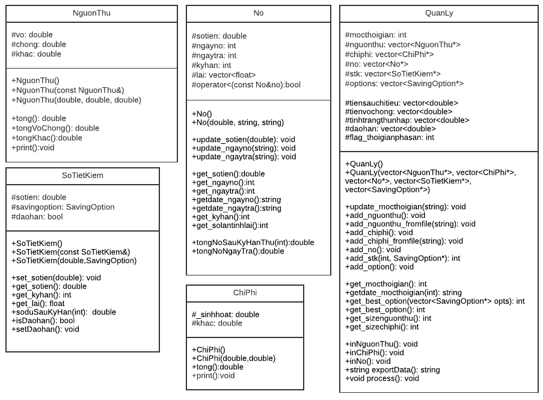

# Bài tập OOP cuối kỳ 2 năm 2 2022 - Quản lý (nguồn thu, chi tiêu, nợ, sổ tiết kiệm)

# Thành viên nhóm 5

- Nguyễn Quang Tuyến 20120621
- Trần Kim Bảo 20120041
- Nguyễn Đăng Nam 20120140

# UML

[link](https://lucid.app/lucidchart/fdb74ce6-cb66-4911-88c0-12c83dac9f05/view) 

